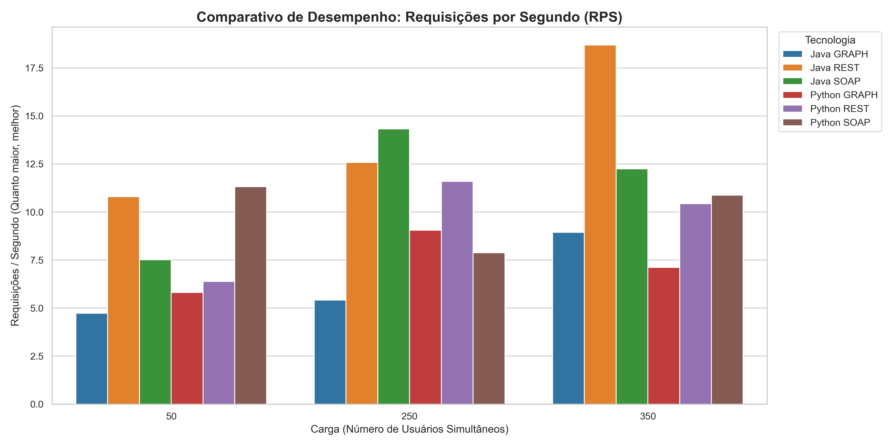
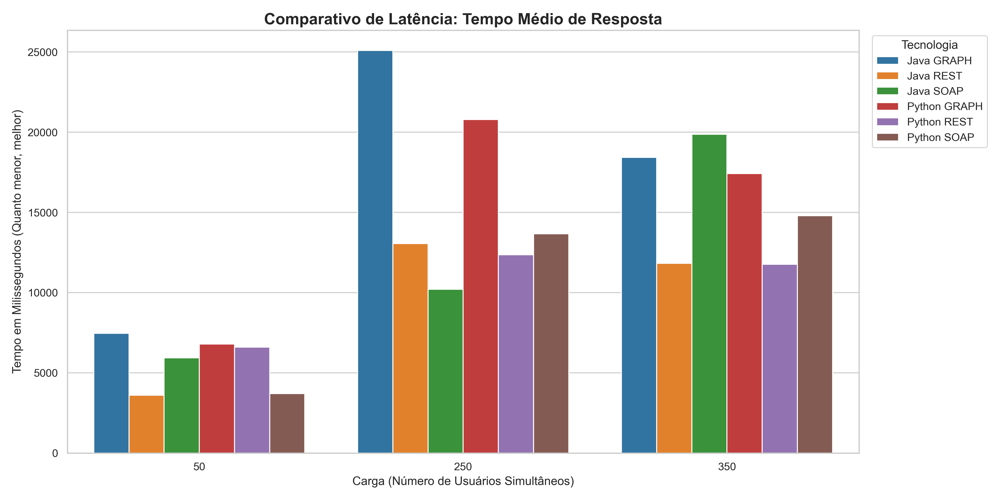

# Comparação de Tecnologias de Invocação de Serviços Remotos

**Equipw:**

  * José Ricardo (2315044)
  * João Pedro Monteiro (2224191)
  * João Pedro Magalhães (2517985)

## 1\. Introdução

Este projeto tem como objetivo explorar, implementar e comparar quatro das principais tecnologias de invocação de serviços remotos utilizadas no desenvolvimento de sistemas distribuídos: **REST**, **SOAP**, **GraphQL** e **gRPC**.

O estudo foi realizado através da implementação de um **Serviço de Streaming de Músicas**, utilizando uma arquitetura distribuída e poliglota (Python e Java) compartilhando uma mesma base de dados.

-----

## 2\. Fundamentação Teórica e Exemplos de Implementação

Conforme solicitado, apresentamos exemplos de implementação utilizando a linguagem **Python** para ilustrar as diferenças sintáticas.

### 2.1. REST (Representational State Transfer)

Estilo arquitetural que utiliza os verbos HTTP padrão. É a tecnologia mais popular devido à sua simplicidade e uso de JSON.

  * **Exemplo de Código (Python/FastAPI):**

<!-- end list -->

```python
@app.get("/usuarios")
def listar_usuarios(db: Session = Depends(get_db)):
    return db.query(bd.Usuario).all()
```

### 2.2. SOAP (Simple Object Access Protocol)

Protocolo baseado em XML, conhecido por sua rigidez e contratos bem definidos (WSDL).

  * **Exemplo de Código (Python/Spyne):**

<!-- end list -->

```python
@rpc(Unicode, Integer, _returns=UsuarioModel)
def criar_usuario(ctx, nome, idade):
    return UsuarioModel(id=novo.id, nome=novo.nome, idade=novo.idade)
```

### 2.3. GraphQL

Linguagem de consulta que permite ao cliente pedir exatamente os campos que necessita, evitando tráfego desnecessário.

  * **Exemplo de Código (Python/Strawberry):**

<!-- end list -->

```python
@strawberry.type
class Query:
    @strawberry.field
    def todos_usuarios(self) -> List[UsuarioType]:
        return db.query(bd.Usuario).all()
```

### 2.4. gRPC (Google Remote Procedure Call)

Framework de alta performance que usa HTTP/2 e Protobuf (binário).

  * **Exemplo de Código (Python/gRPC):**

<!-- end list -->

```python
def CriarUsuario(self, request, context):
    return streaming_pb2.UsuarioResponse(id=novo.id, nome=request.nome)
```

-----

## 3\. Cenário de Implementação e Arquitetura

O sistema permite o gerenciamento de **Usuários**, **Músicas** e **Playlists**. A arquitetura foi desenhada para garantir a interoperabilidade:

  * **Banco de Dados:** MySQL 8 rodando em Docker (Porta 3307).
  * **Backend:** Duas implementações paralelas (Python e Java) acessando os mesmos dados simultaneamente.

-----

## 4\. Análise Crítica e Resultados dos Testes de Carga

Realizamos testes de carga comparativos utilizando a ferramenta **Locust**, simulando diferentes cenários de uso (50, 250 e 350 usuários simultâneos).

### 4.1. Visualização dos Resultados

**Gráfico 1: Throughput (Requisições por Segundo)**
*Quanto maior a barra, maior a capacidade de atendimento do servidor.*



**Gráfico 2: Latência (Tempo Médio de Resposta)**
*Quanto menor a barra, mais rápida foi a resposta.*



-----

#### 4.2. Discussão dos Resultados

  * **REST vs. SOAP (O Custo do XML):** O REST demonstrou ser a tecnologia mais estável. No teste de estresse com **350 usuários** baixando a lista completa de músicas, a implementação SOAP em Python sofreu colapso, apresentando uma **taxa de erro de aproximadamente 10%** e recusa de conexões. Isso evidencia que o *overhead* do parsing de XML consome excessivamente CPU e memória, tornando o SOAP inviável para cenários de *Big Data* ou alta concorrência comparado à leveza do JSON no REST.

  * **A "Falsa Lentidão" do GraphQL:** Visualmente, o GraphQL apresenta menos "Requisições por Segundo" (RPS) no gráfico, mas isso comprova sua eficiência. Para baixar todo o banco de dados (Usuários, Músicas e Playlists), o GraphQL exigiu apenas **1 requisição HTTP**, enquanto o REST exigiu **3 *round-trips* (viagens)** ao servidor. Ou seja, o GraphQL economizou latência de rede, embora tenha exigido mais processamento da CPU para montar o JSON aninhado.

  * **Java vs. Python:** A implementação em **Java (Spring Boot)** demonstrou superioridade esmagadora em processamento de carga pesada. Enquanto o Python (interpretado) atingiu seu teto de processamento em 250 usuários, o Java (compilado e com *multithreading* real) manteve o throughput linear e tempos de resposta baixos até o limite do teste, provando ser a escolha mais robusta para *backends* que exigem serialização massiva de dados.

-----

### 4.3. Por que o gRPC não está nos gráficos?

Embora o gRPC tenha sido implementado e testado funcionalmente com sucesso, ele não foi incluído nos gráficos comparativos do Locust.

  * **Motivo Técnico:** O Locust é uma ferramenta projetada nativamente para protocolos HTTP/1.1 (texto). O gRPC opera sobre **HTTP/2** com serialização binária (**Protobuf**).
  * **Análise Teórica:** Testes de carga em gRPC exigem ferramentas específicas (como `ghz`). No entanto, a literatura e nossos testes unitários indicam que o gRPC seria **superior a todas as outras tecnologias** (REST/SOAP/GraphQL) em volume de dados trafegados, pois o formato binário é muito menor que JSON ou XML, resultando em menor latência de rede.
